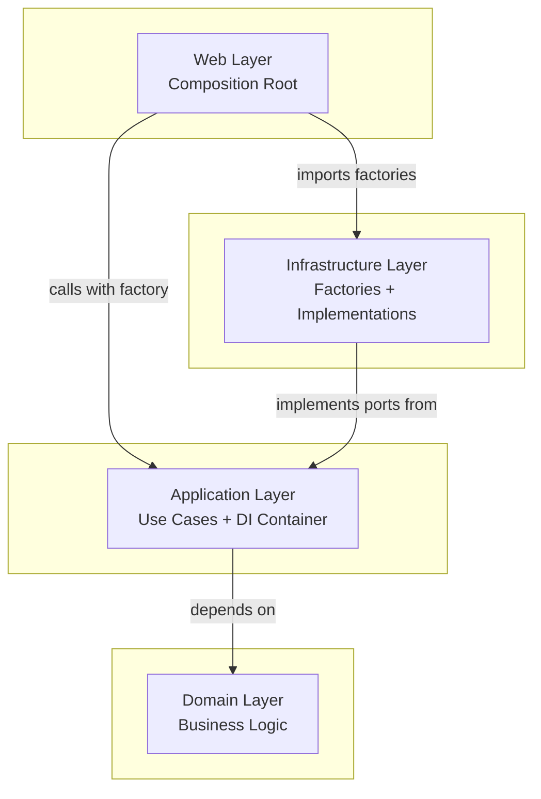

# Architecture Guide - DDD + Hexagonal + SOLID

## Overview

This project combines three complementary architectural patterns to create a
maintainable, testable, and extensible codebase:

- **Domain-Driven Design (DDD)**: Focus on business logic and domain modeling
- **Hexagonal Architecture (Ports & Adapters)**: Isolate domain from external
  concerns
- **SOLID Principles**: Ensure code quality and maintainability

## How They Work Together

```
┌───────────────────────────────────────────────────────┐
│                HEXAGONAL ARCHITECTURE                 │
│                                                       │
│  ┌────────────────────────────────────────────────┐   │
│  │            DOMAIN LAYER (DDD)                  │   │
│  │                                                │   │
│  │  • Aggregates (Game)                           │   │
│  │  • Entities (TeamInGame, PlayerInGame)         │   │
│  │  • Value Objects (PlayerId, Score)             │   │
│  │  • Domain Events (GameStarted, AtBatRecorded)  │   │
│  │  • Domain Services (RBICalculator)             │   │
│  │                                                │   │
│  │  SOLID: Single Responsibility + Open/Closed    │   │
│  └────────────────────────────────────────────────┘   │
│                           ▲                           │
│                    No Dependencies                    │
│                           │                           │
│  ┌────────────────────────────────────────────────┐   │
│  │          APPLICATION LAYER (PORTS)             │   │
│  │                                                │   │
│  │  • Use Cases (RecordAtBatUseCase)              │   │
│  │  • Driving Ports (GameCommandService)          │   │
│  │  • Driven Ports (GameRepository, EventStore)   │   │
│  │                                                │   │
│  │  SOLID: Interface Segregation + Dep. Inversion │   │
│  └────────────────────────────────────────────────┘   │
│                           ▲                           │
│                    Implements Ports                   │
│                           │                           │
│  ┌──────────────┬─────────────────┬──────────────┐    │
│  │   ADAPTERS   │    ADAPTERS     │   ADAPTERS   │    │
│  │              │                 │              │    │
│  │   Web UI     │   IndexedDB     │   Console    │    │
│  │ (Controllers)│ (Repositories)  │  (Logger)    │    │
│  │              │                 │              │    │
│  │ SOLID: LSP   │   SOLID: LSP    │  SOLID: LSP  │    │
│  └──────────────┴─────────────────┴──────────────┘    │
└───────────────────────────────────────────────────────┘
```

## Layer Responsibilities

### Domain Layer (Pure Business Logic)

**DDD Concepts Applied:**

- **Aggregates**: Game is the only aggregate root
- **Entities**: Have identity, can change state
- **Value Objects**: Immutable, equality by value
- **Domain Events**: What happened in past tense
- **Domain Services**: Stateless business logic

**SOLID Principles Applied:**

- **S**: Each class has single responsibility
- **O**: Open for extension via inheritance/composition
- **L**: Implementations can be substituted
- **I**: Not applicable (no interfaces in domain)
- **D**: No dependencies on other layers

```typescript
// Example: Game aggregate follows SRP
class Game {
  // Single Responsibility: Manage game state
  recordAtBat(command: RecordAtBatCommand): void;
  substitutePlayer(command: SubstitutePlayerCommand): void;
  endInning(): void;

  // Open/Closed: Extensible via events
  private applyEvent(event: DomainEvent): void;
}

// Value Object with equality
class PlayerId {
  equals(other: PlayerId): boolean {
    return this.value === other.value; // Value equality
  }
}
```

### Application Layer (Use Cases + Ports)

**Hexagonal Concepts Applied:**

- **Driving Ports**: Interfaces for external systems to call us
- **Driven Ports**: Interfaces for external systems we depend on
- **Use Cases**: Application-specific business rules

**SOLID Principles Applied:**

- **I**: Interface Segregation - specific, focused interfaces
- **D**: Dependency Inversion - depend on abstractions

```typescript
// Driving Port (Interface Segregation)
interface GameCommandService {
  recordAtBat(command: RecordAtBatCommand): Promise<void>;
  substitutePlayer(command: SubstitutePlayerCommand): Promise<void>;
}

// Driven Port (Dependency Inversion)
interface GameRepository {
  findById(id: GameId): Promise<Game>;
  save(game: Game): Promise<void>;
}

// Use Case (Single Responsibility)
class RecordAtBatUseCase implements GameCommandService {
  constructor(
    private gameRepo: GameRepository, // Depends on abstraction
    private eventStore: EventStore // Not concrete implementation
  ) {}
}
```

### Infrastructure Layer (Adapters)

**Hexagonal Concepts Applied:**

- **Primary Adapters**: Drive the application (Web controllers)
- **Secondary Adapters**: Driven by application (Database repositories)

**SOLID Principles Applied:**

- **L**: Liskov Substitution - any adapter can replace another
- **S**: Single Responsibility - each adapter handles one concern

```typescript
// Primary Adapter (Web Controller)
class GameController {
  constructor(
    private recordAtBat: RecordAtBatUseCase // Uses application port
  ) {}

  async handleAtBatRequest(req: Request): Promise<Response> {
    // Single Responsibility: Handle HTTP concerns only
  }
}

// Secondary Adapter (Database Repository)
class IndexedDBGameRepository implements GameRepository {
  // Liskov Substitution: Can replace any GameRepository
  async findById(id: GameId): Promise<Game> {
    // Single Responsibility: IndexedDB persistence only
  }
}
```

## Event Sourcing Architecture

```
┌─────────────────┐    ┌─────────────────┐    ┌─────────────────┐
│   Command       │    │   Domain        │    │   Event         │
│   Handler       │───▶│   Aggregate     │───▶│   Store         │
│   (Use Case)    │    │   (Game)        │    │                 │
└─────────────────┘    └─────────────────┘    └─────────────────┘
         │                       │                       │
         │                       ▼                       │
         │              ┌──────────────────┐             │
         │              │  Domain Events   │             │
         │              │  (AtBatRecorded) │             │
         │              └──────────────────┘             │
         │                                               │
         ▼                                               ▼
┌─────────────────┐                              ┌─────────────────┐
│   Read Model    │                              │   Undo/Redo     │
│   (Projections) │◀─────────────────────────────│   System        │
└─────────────────┘                              └─────────────────┘
```

### Read Models and CQRS Strategy

While [ADR-002](../adr/ADR-002-event-sourcing-pattern.md) notes that we have
deferred implementing a full CQRS (Command Query Responsibility Segregation)
pattern to avoid initial complexity, our architecture fully embraces its core
principle: separating the model used for writing data (commands) from the models
used for reading data (queries).

**The Write Model:**

- This is our event-sourced `Game` aggregate.
- It is optimized for consistency and enforcing business rules. It contains all
  the complex logic required to handle commands like `recordAtBat`.
- Querying aggregates directly for complex reads (e.g., "get all-time stats for
  a player") is inefficient, as it would require loading and replaying hundreds
  or thousands of events.

**The Read Model(s):**

- These are simple, denormalized data structures optimized for specific queries
  required by the UI. They are also known as **projections**.
- For example, we will create a `PlayerStats` read model that stores the
  aggregated statistics for each player.
- This read model is updated by an event handler that listens for relevant
  events (like `AtBatRecorded`). When an event occurs, the handler updates the
  `PlayerStats` table.
- When the UI needs to display player statistics, it makes a simple, fast query
  against this read model, providing excellent performance.

This approach gives us the transactional integrity of aggregates on the write
side and the high performance of dedicated read models on the read side, without
the need for a complex CQRS framework at this stage.

### Undo/Redo Implementation

```typescript
class EventStore {
  private events: DomainEvent[] = [];
  private currentPosition: number = -1;

  // Command pattern for undo/redo
  undo(): DomainEvent | null {
    if (this.currentPosition < 0) return null;
    return this.events[this.currentPosition--];
  }

  redo(): DomainEvent | null {
    if (this.currentPosition >= this.events.length - 1) return null;
    return this.events[++this.currentPosition];
  }
}

class Game {
  // State reconstruction from events
  static reconstitute(id: GameId, events: DomainEvent[]): Game {
    const game = Game.empty(id);
    events.forEach(event => game.applyEvent(event));
    return game;
  }
}
```

## Testing Strategy

### Domain Layer Testing (100% Pure)

```typescript
describe('Game', () => {
  it('should calculate RBI correctly for sacrifice fly', () => {
    // No mocks needed - pure domain logic
    const game = Game.create('Red Sox', 'Yankees');
    const result = game.recordAtBat({
      batterId: new PlayerId('williams'),
      result: AtBatResultType.SACRIFICE_FLY,
    });

    expect(result.rbi).toBe(1);
  });
});
```

### Application Layer Testing (Mock Ports)

```typescript
describe('RecordAtBatUseCase', () => {
  it('should save game after recording at-bat', async () => {
    const mockRepo = mock<GameRepository>();
    const useCase = new RecordAtBatUseCase(mockRepo, mockEventStore);

    await useCase.execute(command);

    verify(mockRepo.save(any())).once();
  });
});
```

### Infrastructure Layer Testing (Integration)

```typescript
describe('IndexedDBGameRepository', () => {
  it('should persist and retrieve game correctly', async () => {
    const repo = new IndexedDBGameRepository();
    const game = Game.create('Red Sox', 'Yankees');

    await repo.save(game);
    const retrieved = await repo.findById(game.getId());

    expect(retrieved.getScore()).toEqual(game.getScore());
  });
});
```

## Dependency Flow

Dependencies flow in a single direction: **inward**. Outer layers depend on
inner layers, but inner layers know nothing about the outside world.



**Key Rules:**

1.  **Web Layer**: Acts as Composition Root - imports Infrastructure factories
    and wires dependencies at entry point
2.  **Application Layer**: Uses **DI Container with Factory Injection**
    pattern - accepts Infrastructure factories as parameters
3.  **Domain Is Independent**: The `Domain` layer has **zero** dependencies on
    any other layer
4.  **Infrastructure Layer**: Provides factory implementations that Web layer
    imports and passes to Application

**For complete architectural patterns and Composition Root implementation
details, see [Architecture Patterns](../architecture-patterns.md)**

## Architecture Enforcement Rules

Our architecture is enforced automatically through both **dependency-cruiser**
and **ESLint boundaries plugin**. These tools prevent violations at development
time and in CI/CD.

### Dependency-Cruiser Rules

Located in `.dependency-cruiser.cjs`, these rules enforce the strict Hexagonal
Architecture boundaries:

#### 1. Domain Layer Isolation (`domain-layer-isolation`)

- **Rule**: Domain layer must not depend on any other layer
- **Severity**: ERROR
- **Rationale**: Domain must remain pure business logic with zero external
  dependencies

```javascript
// ✅ ALLOWED: Internal domain imports
import { PlayerId } from '../value-objects/PlayerId';
import { DomainError } from '../errors/DomainError';

// ❌ FORBIDDEN: Any external layer dependencies
import { GameRepository } from '../../application/ports/GameRepository'; // ERROR
import { Logger } from '../../infrastructure/logging/Logger'; // ERROR
```

#### 2. Application Layer Restrictions (`application-layer-restrictions`)

- **Rule**: Application layer can only depend on domain layer
- **Severity**: ERROR
- **Rationale**: Application orchestrates domain logic but shouldn't know about
  infrastructure

```javascript
// ✅ ALLOWED: Domain dependencies
import { Game } from '@twsoftball/domain';
import { GameId } from '@twsoftball/domain';

// ❌ FORBIDDEN: Infrastructure or web dependencies
import { IndexedDBRepository } from '../../infrastructure/persistence'; // ERROR
import { ApiResponse } from '../../web/types'; // ERROR
```

#### 3. Infrastructure Layer Restrictions (`infrastructure-layer-restrictions`)

- **Rule**: Infrastructure can only depend on domain, application, and shared
  layers
- **Severity**: ERROR
- **Rationale**: Infrastructure implements application ports and uses domain
  objects

```javascript
// ✅ ALLOWED: Domain and application dependencies
import { Game } from '@twsoftball/domain';
import { GameRepository } from '@twsoftball/application';

// ✅ ALLOWED: Shared utilities for Infrastructure
import { SecureRandom } from '@twsoftball/shared';

// ❌ FORBIDDEN: Web dependencies
import { WebConfig } from '../../web/config'; // ERROR
```

#### 4. Web Layer Restrictions (`web-layer-restrictions`)

- **Rule**: Web layer acts as Composition Root - can import Infrastructure
  factory functions
- **Severity**: ERROR (with exceptions for factory imports)
- **Rationale**: Web uses Composition Root pattern - imports factories to wire
  dependencies at entry point

```javascript
// ✅ ALLOWED: Composition Root pattern - importing factories
import { createIndexedDBFactory } from '@twsoftball/infrastructure/web';
import { createMemoryFactory } from '@twsoftball/infrastructure/memory';
import { createApplicationServicesWithContainerAndFactory } from '@twsoftball/application';

const factory =
  config.storage === 'memory'
    ? createMemoryFactory()
    : createIndexedDBFactory();
const services = await createApplicationServicesWithContainerAndFactory(
  config,
  factory
);

// ❌ FORBIDDEN: Direct repository/implementation imports
import { IndexedDBRepository } from '../../infrastructure/persistence'; // ERROR
import { IndexedDBGameRepository } from '@twsoftball/infrastructure/web'; // ERROR
```

#### 5. Shared Layer Isolation (`shared-layer-isolation`)

- **Rule**: Shared utilities must not depend on application or infrastructure
  layers
- **Severity**: ERROR
- **Rationale**: Shared code must remain completely independent to maintain
  architectural integrity. Test utilities needing domain types should be placed
  within the domain package itself.

```javascript
// ✅ ALLOWED: Standard libraries only
import { v4 as uuidv4 } from 'uuid';

// ❌ FORBIDDEN: Any project layer dependencies
import { PlayerId } from '@twsoftball/domain'; // ERROR - violates independence
import { GameRepository } from '@twsoftball/application'; // ERROR
import { IndexedDBRepository } from '@twsoftball/infrastructure'; // ERROR
```

#### 6. Framework Import Restrictions (`no-direct-framework-imports-in-domain`)

- **Rule**: Domain layer cannot import framework-specific libraries
- **Severity**: ERROR
- **Rationale**: Domain must remain technology-agnostic

```javascript
// ❌ FORBIDDEN: Framework dependencies in domain
import React from 'react'; // ERROR
import axios from 'axios'; // ERROR
import express from 'express'; // ERROR
```

#### 7. Ports and Adapters Pattern (`ports-and-adapters-pattern`)

- **Rule**: Infrastructure should implement application ports, not create direct
  dependencies
- **Severity**: WARNING
- **Rationale**: Encourages proper port/adapter pattern usage

#### 8. Circular Dependencies (`no-circular-dependencies`)

- **Rule**: Circular dependencies are not allowed anywhere
- **Severity**: ERROR
- **Rationale**: Prevents architectural degradation and dependency loops

#### 9. Configuration File Exclusions (`no-orphans`)

- **Rule**: Exclude config and build artifacts from orphan detection
- **Excludes**: `vitest.config.ts`, `vite.config.ts`, coverage files, dist files
- **Rationale**: These files are intentionally standalone

### ESLint Boundaries Plugin

Located in `.eslintrc.cjs`, these rules complement dependency-cruiser with
import-level enforcement:

```javascript
'boundaries/element-types': ['error', {
  default: 'disallow',
  rules: [
    { from: 'domain', allow: ['domain'] },                    // Domain isolation
    { from: 'application', allow: ['domain', 'application'] }, // App + Domain only
    { from: 'infrastructure', allow: ['domain', 'application', 'infrastructure', 'shared'] },
    { from: 'web', allow: ['application'] }, // DI Container only
    { from: 'shared', allow: ['shared'] },                   // Shared isolation
  ],
}]
```

### Verification Commands

Run these commands to validate architecture compliance:

```bash
# Check dependency rules
pnpm deps:check

# Check ESLint boundaries
pnpm lint

# Full validation
pnpm typecheck && pnpm deps:check && pnpm lint
```

### Architecture Violations Response

When violations are detected:

1. **Immediate Feedback**: Pre-commit hooks prevent commits with violations
2. **CI/CD Blocking**: GitHub Actions fail on any architecture rule violation
3. **Clear Error Messages**: Each rule explains WHY the dependency is forbidden
4. **Fix Guidance**: Error messages suggest proper architectural solutions

Example violation message:

```
error infrastructure-layer-restrictions:
  packages/infrastructure/persistence/GameRepository.ts → packages/shared/utils/HttpClient.ts

Infrastructure layer can only depend on domain, application, and shared layers.
Move HTTP client to application ports or use dependency injection.
```

This comprehensive rule set ensures our Hexagonal Architecture remains intact as
the codebase evolves, preventing the common problem of architectural erosion
over time.

## Benefits of This Architecture

### DDD Benefits

- **Business Focus**: Code reflects domain concepts
- **Rich Models**: Behavior lives with data
- **Ubiquitous Language**: Shared understanding
- **Event Sourcing**: Perfect audit trail + undo/redo

### Hexagonal Benefits

- **Testability**: Domain can be tested in isolation
- **Flexibility**: Swap databases/UIs without changing domain
- **Independence**: Domain doesn't know about frameworks
- **Clean Boundaries**: Clear separation of concerns

### SOLID Benefits

- **Maintainability**: Easy to modify and extend
- **Testability**: Each class has focused responsibility
- **Flexibility**: Implementations can be substituted
- **Quality**: Follows proven OOP principles

Together, these patterns create a codebase that is:

- ✅ Easy to test (no external dependencies in core)
- ✅ Easy to maintain (clear responsibilities)
- ✅ Easy to extend (open/closed principle)
- ✅ Business-focused (domain-driven design)
- ✅ Technology-agnostic (hexagonal boundaries)

## See Also

- **[ADR-001: DDD + Hexagonal Architecture + SOLID](../adr/ADR-001-ddd-hexagonal-solid.md)** -
  Architectural decision rationale
- **[Domain Model](domain-model.md)** - Detailed domain specification
- **[Event Sourcing Guide](event-sourcing.md)** - Event sourcing implementation
- **[API Contracts](api-contracts.md)** - Interface definitions for all layers
- **[Use Cases](use-cases.md)** - User stories and requirements
- **[Development Guide](../guides/development.md)** - Setup and workflow
  instructions
